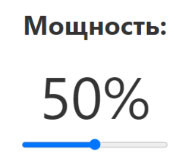

# Тестовое задание

Необходимо разработать простую программу используя
[NodeJS](https://nodejs.org/ru) + [TypeScript](https://www.typescriptlang.org/) + [Svelte Kit](https://kit.svelte.dev/),
которая будет читать значение мощности c MQTT сервера
и отправлять новое значение при движении ползунка.\
Если открыть несколько вкладок в браузере при изменении значения
в одном месте оно автоматически будет меняться во всех вкладках.

Этот блок необходимо реализовать как отдельный компонент Svelte.\
MQTT сервер (брокер) используйте этот: [Mosquitto Test](https://test.mosquitto.org/)

Интерфейс программы должен выглядеть так:\
